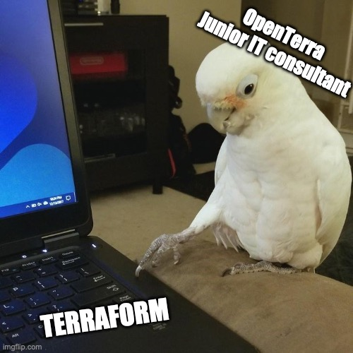

# IAC-H23
For the course Infrastructure as Code IIKG3005. 

At OpenTerraAS, responsibility for any security lapses is firmly placed on the shoulders of our junior IT consultants. This formal protocol ensures that they bear the economic and legal consequences, emphasizing the importance of their role in safeguarding our digital assets.

